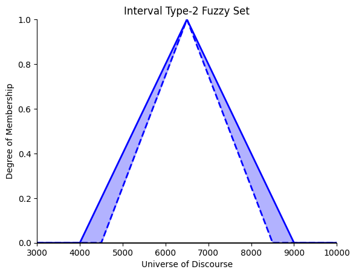
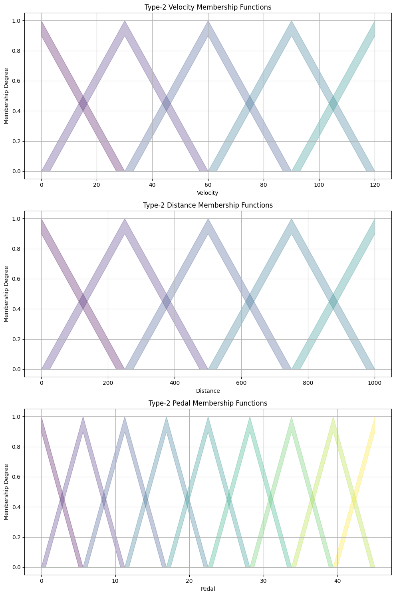

# Type-2 Fuzzy Logic Systems

## Introduction
This repository contains the implementation of a Type-2 Fuzzy Inference System (FIS), demonstrating the concept of fuzzy logic where uncertainty is accounted for with type-2 fuzzy sets. This project is part of a larger study on fuzzy logic and its applications in control systems, data analysis, and decision-making processes.

## About Type-2 Fuzzy Logic Systems
Type-2 fuzzy sets introduce an additional degree of uncertainty to the membership functions, compared to traditional type-1 fuzzy sets. This added complexity allows for handling situations where it's challenging to determine an exact membership degree due to noise, measurement errors, or linguistic ambiguities.

## Getting Started
To run the code included in this repository, you will need to have Python installed on your system along with the following libraries:
- Pandas
- NumPy
- Matplotlib
- gdown

You can install these packages using pip:
```shell
pip install pandas numpy matplotlib gdown
```

## Code Overview

### Code Block 1 - Fuzzy Inference System Outputs
This code initializes a Type-2 FIS with triangular membership functions, loads data from a specified source, and performs fuzzy inference to calculate the output based on velocity and distance inputs.

#### Plot: Fuzzy Inference System Outputs

This plot visualizes the outputs of the fuzzy inference system, showing how the pedal output is determined based on different velocity and distance inputs.

### Code Block 2 - Interval Type-2 Fuzzy Set
This script demonstrates the construction of an interval type-2 fuzzy set, defining the upper and lower membership functions and displaying the shaded area that represents the Footprint of Uncertainty (FOU).

#### Plot: Interval Type-2 Fuzzy Set

The plot provides a graphical representation of an interval type-2 fuzzy set with the uncertainty between the upper and lower membership functions clearly illustrated.

### Code Block 3 - Type-2 Membership Functions
This code defines a class for a Type-2 FIS, including the functionality to plot membership functions for velocity, distance, and pedal parameters with a constant Footprint of Uncertainty (FOU).

#### Plot: Type-2 Membership Functions

This figure contains three subplots showing the type-2 membership functions for velocity, distance, and pedal, highlighting the area of uncertainty between the upper and lower membership functions.

## Conclusion
This repository serves as a starting point for those interested in exploring the implementation and application of Type-2 Fuzzy Logic Systems. Users are encouraged to delve deeper into the code, adapt it to their specific needs, and contribute to the study of fuzzy logic.

For questions, collaborations, or contributions, feel free to open an issue or a pull request.
